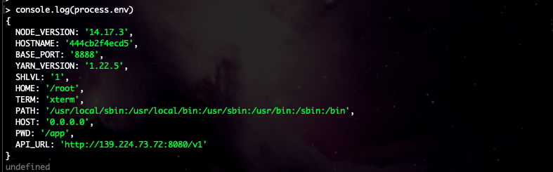

前言: 最近在做一个前端项目。为了使用服务端渲染，使用 nuxt 写的。项目已经完成的差不多了。本来是采用 pm2 + nginx 反向代理的方式部署的应用的。

> 但是最近有个新的需求就是。每次部署需要自定义 http 请求的接口地址 axios.defaults.baseURL

于是就打算使用 docker 构建一个镜像。利用`docker run -d -e API_URL={api url} ....`的形式来启动项目。

利用 docker 的 **-e** 参数可以向容器写入一个自定义的环境变量。做到前端可以通过环境变量的形式来调用 api 接口

例如 `axios.defaults.baseURL = process.env.API_URL `

> 但理想是美好的。现实总是残忍的。。。

- 构建镜像
- 写入自定义参数。启动 image 镜像
- 访问对应端口的项目

发现项目能够正常访问。但是项目并没有读取到设置的环境变量。然后进入 docker 容器内部查看。发现容器内部也是生成了自定义读取的变量。但是 next 项目却无法通过 `process.env.API_URL` 这种形式来调取。这就很奇怪了。



经过一番搜索之后。在 nuxt 官方文档发现了 Runtime config properties（运行时配置属性） 这个配置项。

在 `next.config.js`中添加如下配置。那么我们在打包成 docker 镜像之后通过` λ docker run -d -e API_URL=https://nuxtjs.org` 这种形式注入的参数就可以在前端项目中通过环境变量的形式引用到

```javascript
export default {
  publicRuntimeConfig: {
    baseURL: process.env.BASE_URL || "https://nuxtjs.org",
  },
};
```

在 nuxt plugins 中 引用的 axios 可以通过以下形式来调用

```javascript
export default function ({ $axios, redirect, $config }) {
  $axios.defaults.baseURL = $config.API_URL;
  $axios.defaults.timeout = 30000;
  $axios.onError((error) => {
    if (error.response.status === 500) {
      redirect("/error");
    }
  });
}
```

在 vue 页面中可以通过 `this.$config.API_URL`来调用
