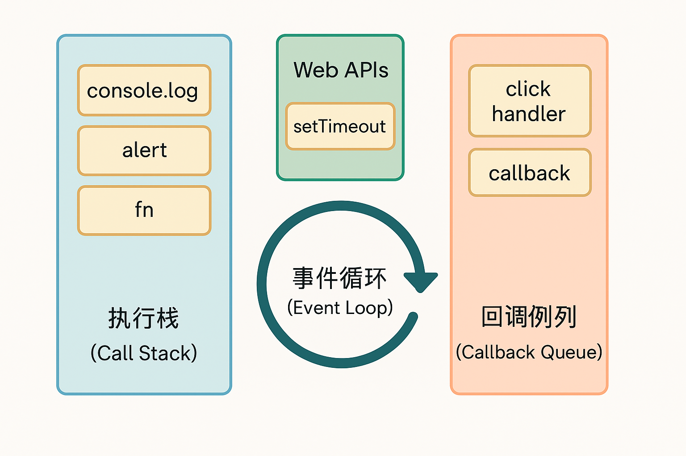

# 如何理解 JavaScript 中的事件循环（Event Loop）

JavaScript 是一种**单线程**语言，它通过事件循环（Event Loop）机制来实现异步操作的调度与执行。理解事件循环有助于我们更好地编写异步代码，避免一些常见的“回调陷阱”或异步顺序错误。

---



## 1. 什么是事件循环？

事件循环是一种协调机制，用于决定哪些代码在何时执行，特别是在处理异步任务（如定时器、网络请求、Promise 等）时。事件循环的核心流程包括：

1. 执行同步代码（同步任务进入调用栈）
2. 执行所有微任务（Microtasks）
3. 从宏任务队列中取出下一个宏任务执行
4. 重复上述过程

---

## 2. 同步任务 vs 异步任务

- **同步任务**：立即执行，按顺序排列在调用栈中。
- **异步任务**：交由浏览器或 Node 的 Web API 执行，完成后加入任务队列中等待执行。

---

## 3. 微任务与宏任务

| 类型                 | 举例                                           | 特点                             |
| -------------------- | ---------------------------------------------- | -------------------------------- |
| **微任务 Microtask** | Promise.then、MutationObserver、queueMicrotask | 在当前宏任务完成后立即执行       |
| **宏任务 MacroTask** | setTimeout、setInterval、I/O、setImmediate     | 会排队等待事件循环进入下一个周期 |

---

## 4. 执行顺序示例

```js
console.log("1");

setTimeout(() => {
  console.log("2");
}, 0);

Promise.resolve().then(() => {
  console.log("3");
});

console.log("4");
```

输出结果：

```javascript
1;
4;
3;
2;
```

### 原因分析：

1. `console.log('1')` 和 `console.log('4')` 是同步任务，先执行。
2. `setTimeout` 是宏任务，进入任务队列。
3. `Promise.then` 是微任务，在当前宏任务执行完后立即执行。
4. 所以先输出 3，然后才是 `setTimeout` 的 2。

## 5. setTimeout(fn, 0) 并不是“立即执行”

即便设置为 0 毫秒，setTimeout 回调也不会在当前调用栈执行完前运行，因为它是宏任务，会等到所有当前宏任务和微任务完成后才进入执行。

## 6. 实战技巧：分批执行避免阻塞

如果你有一个很大的循环操作，不建议一次性执行

```javascript
// 不推荐：可能阻塞 UI
for (let i = 0; i < 1e9; i++) {
  // do something
}
```

可以改为使用 setTimeout 分批执行：

```javascript
function chunkedTask() {
  for (let i = 0; i < 100000; i++) {
    // do something
  }
  if (moreWork) {
    setTimeout(chunkedTask, 0); // 让出执行权
  }
}
chunkedTask();
```

## 7. 总结

- `JavaScript` 是单线程语言，通过事件循环处理异步任务。微任务优先于宏任务执行。
- `Promise.then` 总是在同步任务之后，`setTimeout` 之后执行。
- 理解事件循环，有助于编写更加流畅、性能更佳的前端应用。
