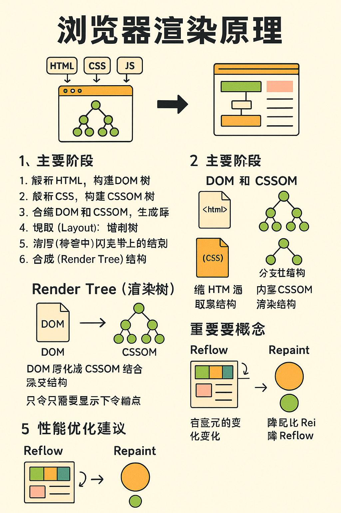

# 浏览器渲染原理

浏览器的主要任务是将 HTML、CSS 和 JavaScript 等资源渲染为用户可以交互的图形界面。本篇文章将简要介绍浏览器渲染的整体流程和关键组件。

---

## 一、浏览器渲染流程概览

浏览器渲染的核心流程如下：

1. **解析 HTML，构建 DOM 树**
2. **解析 CSS，构建 CSSOM 树**
3. **合并 DOM 和 CSSOM，生成渲染树（Render Tree）**
4. **布局（Layout）：计算每个节点的位置和大小**
5. **绘制（Painting）：将各个节点转换为屏幕上的像素**
6. **合成（Compositing）：将不同层的绘制结果合并输出到屏幕**

---

## 二、关键组件解析

### 1. DOM（Document Object Model）

- 将 HTML 文件解析为树状结构的对象模型
- 每个标签元素成为一个 DOM 节点

### 2. CSSOM（CSS Object Model）

- 将所有 CSS 样式解析为一棵样式规则树
- 规则包括样式继承、优先级、选择器等

### 3. Render Tree（渲染树）

- 是由 DOM 和 CSSOM 合并生成
- 只包含需要显示的节点（例如不包含 `display: none` 的节点）

---

## 三、Layout 阶段（又称 Reflow）

- 浏览器会根据 Render Tree 中的每个元素计算其具体的几何位置（宽、高、相对位置）
- 会受到盒模型、定位、字体大小等影响

---

## 四、Painting 阶段

- 浏览器将 Layout 阶段计算的几何信息转换为实际像素
- 涉及颜色填充、文字绘制、阴影、边框等

---

## 五、Compositing（合成）

- 对包含多个图层的页面内容进行层合成
- 使用 GPU 加速的方式将各层合并，生成最终画面
- 常见触发合成的情况有：`transform`, `opacity`, `position: fixed`, `will-change` 等

---

## 六、关键概念

### Reflow（回流）

- 当元素的位置或尺寸发生变化时，需要重新计算布局
- 代价较大，尽量避免频繁触发

### Repaint（重绘）

- 当元素的样式发生变化，但不影响布局（如颜色、阴影等）
- 成本小于 Reflow，但仍有性能开销

### GPU 加速

- 浏览器通过启用硬件加速，将合成任务交由 GPU 处理
- 提高复杂动画或大图滚动的性能

---

## 七、性能优化建议

- 避免频繁操作 DOM，使用 DocumentFragment 或 requestAnimationFrame
- 使用类名而非内联样式以便样式合并
- 减少嵌套层级，避免复杂选择器
- 对动画元素使用 `will-change` 或 `transform/opacity` 触发 GPU 合成

---

## 八、总结

浏览器渲染是一个涉及多个阶段的复杂过程，从资源加载到最终展示，中间需要处理大量的结构和样式信息。理解这些流程对于前端开发性能优化和调试渲染问题非常重要。
